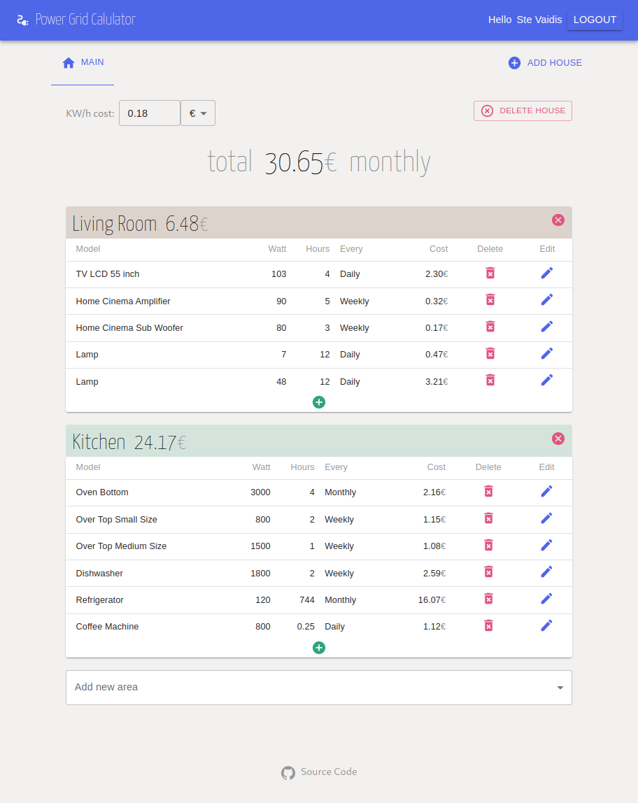

# Power Grid Calculator

https://powerc-1e251.web.app/

Calculator for analyzing the cost of the electricity bill

> This project is made with React, Redux-Toolkit, Material-UI and Firebase

## What you can do with this tool

- Calculate the cost of house electricity
- Add / Remove Houses
- Add / Remove Areas
- Add / Edit / Remove Devices
- Edit the cost of KW/h

## What it looks like



## Install

```bash
git clone https:https://github.com/vaidis/Power-Calc.git
cd React-Power-Calc
npm install
```

## Setup

```bash
code src/firebase/config.js  # change it with your own API settings
```

## Run Development

```
npm start
```

## Run Production

```
npm build
```

## Todo

- User authentication for storing personal setups
- Device Hours available for Monthly, Weekly, Daily
